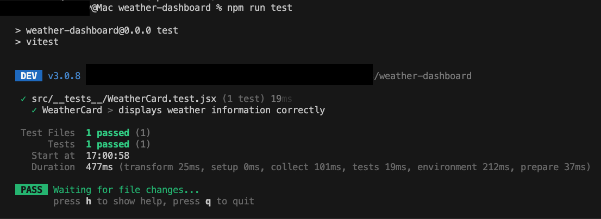

# Weather Dashboard

## Overview
This project is a simple Weather Dashboard built using React, TypeScript, and Vite. It allows users to search for a city and retrieve weather information from an API. The application provides a clean UI with loading states, error handling, and displays weather data in a structured format.

## Features
- Search for a city to get real-time weather data
- Displays temperature, weather conditions, humidity, wind speed, and more
- Shows a loading skeleton while fetching data
- Handles errors gracefully
- Unit tests using Vitest

## Technologies Used
- **React** - UI Library
- **TypeScript** - Static typing
- **Vite** - Build tool
- **CSS** - Styling

## Node.js Version Requirement
To run this project properly, ensure that you have **Node.js v16 or later** installed. You can check your version by running:
```sh
node -v
```
If your version is outdated, update Node.js accordingly.

## Components
### 1. `LoadingSkeleton.tsx`
Displays a skeleton UI while weather data is loading.

### 2. `SearchBar.tsx`
A search bar where users can enter a city name and trigger a search.

### 3. `WeatherCard.tsx`
Displays the weather details for the selected city.

## Application Structure
```
/weather-dashboard
├── src
│   ├── components
│   │   ├── LoadingSkeleton.tsx
│   │   ├── SearchBar.tsx
│   │   ├── WeatherCard.tsx
│   ├── services
│   │   ├── weatherAPI.ts
│   ├── types
│   │   ├── index.ts
│   ├── tests
│   │   ├── WeatherCard.test.tsx
│   ├── App.tsx
│   ├── main.tsx
│   ├── index.css
├── package.json
└── README.md
```

## Running the Project
To get started, clone the repository and install dependencies:
```sh
npm install
```
Run the development server:
```sh
npm run dev
```

## Running Unit Tests
The project includes unit tests using Vitest. To run tests, use the following command:
```sh
npm run test
```

_Example Screenshot of Test Results:_



## API Integration
The application fetches weather data from the OpenWeather API. Make sure to set up an API key and update the `weatherAPI.ts` service accordingly.

## Contributing
Feel free to fork this repository, make improvements, and submit pull requests.